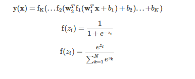
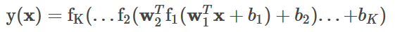
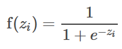
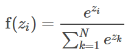

## ML - Clasificador de perceptrones multicapa

 <div style="text-align: justify">
El clasificador de perceptrones multicapa (MLPC) es un clasificador basado en la red neuronal artificial feedforward . MLPC consta de múltiples capas de nodos. Cada capa está completamente conectada a la siguiente capa de la red. Los nodos de la capa de entrada representan los datos de entrada. Todos los demás nodos mapean entradas a las salidas realizando una combinación lineal de las entradas con los pesos y el sesgo del nodo y aplicando una función de activación. Se puede escribir en forma de matriz para MLPC con capas de la siguiente manera: Los nodos en las capas intermedias usan la función sigmoidea (logística): Los nodos en la capa de salida usan la función softmax: El número de nodos en la capa de salida corresponde al número de clases.wbK+1
 
</div>
 
 <div style="text-align: center"
 
 
</div>

N

MLPC emplea retropropagación para aprender el modelo. Usamos la función de pérdida logística para la optimización y L-BFGS como rutina de optimización.


## Arquitectura de capas en MLPC

<div align="justify">Como se describe en la Imagen, MLPC consta de múltiples capas de nodos, incluida la capa de entrada, las capas ocultas (también llamadas capas intermedias) y las capas de salida. Cada capa está completamente conectada a la siguiente capa de la red. Donde la capa de entrada, las capas intermedias y la capa de salida se pueden definir de la siguiente manera:
 
- La **capa de entrada** consta de neuronas que aceptan los valores de entrada. La salida de estas neuronas es la misma que la de los predictores de entrada. Los nodos de la capa de entrada representan los datos de entrada. Todos los demás nodos asignan entradas a salidas mediante una combinación lineal de las entradas con los pesos w del nodo y el sesgo by aplicando una función de activación. Esto se puede escribir en forma de matriz para MLPC con capas K + 1 de la siguiente manera:

 

- Las **capas ocultas** se encuentran entre las capas de entrada y salida. Normalmente, el número de capas ocultas varía de una a muchas. Es la capa de cálculo central que tiene las funciones que asignan la entrada a la salida de un nodo. Los nodos de las capas intermedias utilizan la función sigmoidea (logística), de la siguiente manera


- La **capa de salida** es la capa final de una red neuronal que devuelve el resultado al entorno del usuario. Basado en el diseño de una red neuronal, también indica a las capas anteriores cómo se han desempeñado en el aprendizaje de la información y, en consecuencia, mejoraron sus funciones. Los nodos de la capa de salida utilizan la función softmax.


El número de nodos N, en la capa de salida, corresponde al número de clases.


#### Aplicaciones

Los MLP son útiles en la investigación por su capacidad para resolver problemas estocásticamente, lo que a menudo permite soluciones aproximadas para problemas extremadamente complejos como la aproximación de aptitud.

Los MLP son aproximadores de funciones universales, como lo muestra el teorema de Cybenko,  por lo que pueden usarse para crear modelos matemáticos mediante análisis de regresión. Como la clasificación es un caso particular de regresión cuando la variable de respuesta es categórica, los MLP son buenos algoritmos de clasificación.

Algunas de sus Aplicaciones
- Aprendizaje supervisado (mapeo de entrada / salida):

- Clasificación (salidas discretas):

- Diabetes en los indios Pima;

- Sonar: Rocas vs Minas;

- Regresión (salidas numéricas):

- Cáncer de mama pronóstico;

- Brazo robótico Pumadyn;

- Aprendizaje por refuerzo (el resultado no se conoce perfectamente):

- Control (por ejemplo, conducción autónoma);

- Juego (por ejemplo, damas);


## Programa Ejemplo.
```scala
// Se importa MultilayerPerceptronClassifier y MulticlassClassificationEvaluator
import org.apache.spark.ml.classification.MultilayerPerceptronClassifier
import org.apache.spark.ml.evaluation.MulticlassClassificationEvaluator
// $example off$
// Se impor ta la sesion de Spark
import org.apache.spark.sql.SparkSession

/**
 * An example for Multilayer Perceptron Classification.
 */

 // Creacion del objeto MultilayerPerceptronClassifier
object MultilayerPerceptronClassifierExample {

// Se define la funcion main la cual tiene como parametro un Array de tipo string
  def main(args: Array[String]): Unit = {
    // Se crea el objeto de la clase SparkSession, y a la app se le da el nombre de
    // MultilayerPerceptronClassifierExample
    val spark = SparkSession
      .builder
      .appName("MultilayerPerceptronClassifierExample")
      .getOrCreate()

    // $example on$
    // Se cargan los datos en formato libsvm del archivo como un DataFrame
    val data = spark.read.format("libsvm")
      .load("sample_multiclass_classification_data.txt")

    // Se dividen los datos en entrenamiento y prueba
    val splits = data.randomSplit(Array(0.6, 0.4), seed = 1234L)
    val train = splits(0)
    val test = splits(1)

    // Se especifican las capas de la red neuronal:
    // La capa de entrada es de tamaño 4 (caracteristicas), dos capas intermedias
    // una de tamaño 5 y la otra de tamaño 4
    // y 3 de salida (las clases)
    val layers = Array[Int](4, 5, 4, 3)

    // Se establecen los parametros de entrenamiento
    val trainer = new MultilayerPerceptronClassifier()
      .setLayers(layers)
      .setBlockSize(128)
      .setSeed(1234L)
      .setMaxIter(100)

    // Se entrena el modelo
    val model = trainer.fit(train)

    // Se calcula la precision de los datos de prueba
    val result = model.transform(test)
    val predictionAndLabels = result.select("prediction", "label")
    val evaluator = new MulticlassClassificationEvaluator()
      .setMetricName("accuracy")

    // Se imprime la exactidud del modelo
    println(s"Test set accuracy = ${evaluator.evaluate(predictionAndLabels)}")
    // $example off$

    spark.stop()
  }
}
```
